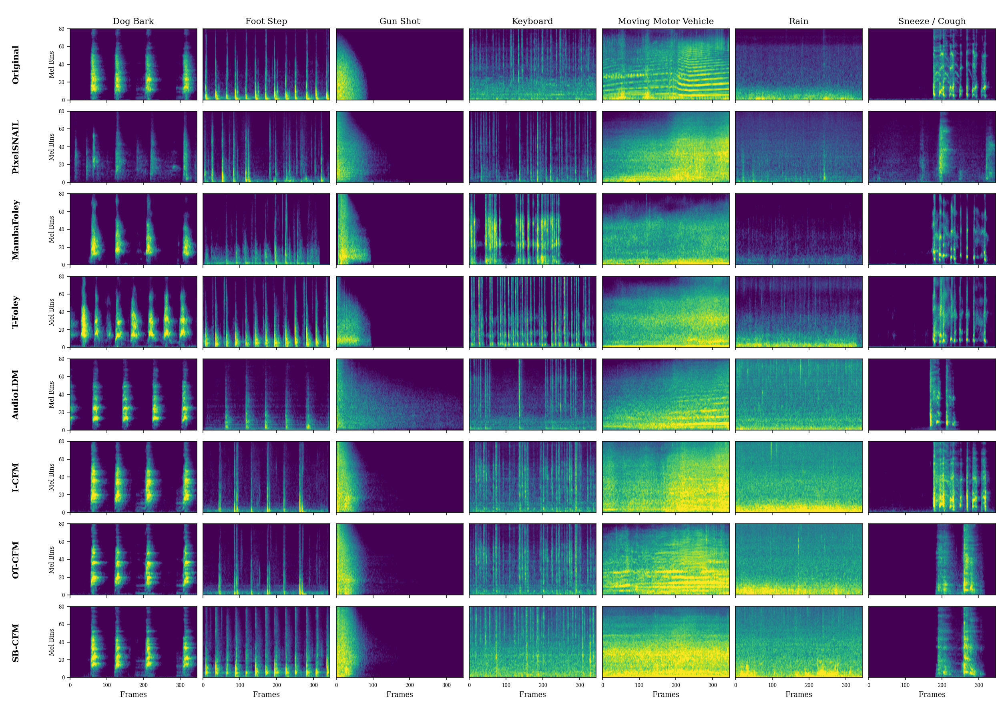

# SB-CFM — Scene-Conditioned Foley Sound Synthesis via Schrödinger Bridge Conditional Flow Matching

Audio demo page for our IEEE Access submission.

**Demo:** https://jjj33325.github.io/sbcfm-demo

Eojin Kim, Chanjun Chun
Department of Computer Engineering, Chosun University, Gwangju, Republic of Korea


**Fig. 1** — Overview of the proposed pipeline. *Training* (top): a target log-mel spectrogram x₁ and a
Gaussian source x₀ are joined by the Schrödinger-bridge path into x_t, and the velocity U-Net
v_θ(x_t, t, c, r) — modulated by class and RMS conditioning — regresses the target velocity under
L_FM. *Inference* (bottom): the same network is integrated from x₀ by the SDE sampler with
classifier-free guidance, and HiFi-GAN renders the result.

---

## What this is

A mel-domain Foley synthesis framework for the DCASE 2023 Challenge Task 7 benchmark, which
asks a system to generate a four-second monophonic clip at 22.05 kHz from one of seven scene
categories: dog bark, footstep, gunshot, keyboard, moving motor vehicle, rain, and sneeze/cough.

The task is small-data (about 5.4 hours of labeled audio) and one-to-many: each label admits many
acoustically valid realizations, so the central tension is between scene fidelity and diversity.
We transport a standard Gaussian source to the data along the **Schrödinger bridge — the
entropy-regularized form of dynamic optimal transport**, whose marginal is the OT displacement
interpolation convolved with a Gaussian kernel that vanishes at both endpoints. This smooths the
interior of the transport path, so the velocity field the network regresses is better conditioned
than the unregularized OT field, while the source and data distributions are matched exactly.
Generation integrates the bridge as an SDE, whose stochasticity broadens the set of realizations
per scene while preserving the target marginals.

Three things distinguish the model:

- **Schrödinger bridge as regularized OT.** SB-CFM contains OT-CFM (σ=0) and I-CFM (independent
  coupling) as exact limits, so the flow formulation can be decomposed one axis at a time. Most of
  the margin comes from the flow-matching framework and the optimal-transport coupling; the bridge
  is a meaningful but not dominant component.
- **RMS temporal conditioning.** The frame-level RMS envelope of the target is injected through
  block-wise FiLM, giving explicit control over *when* energy appears. It is the single most
  important component: removing it more than doubles FAD.
- **SDE sampling with a score network.** A second network predicts the bridge score, so the SDE we
  integrate is a genuine discretization of the Schrödinger-bridge SDE. The bridge and the SDE act as
  a pair: under deterministic sampling the bridge trades semantic alignment for distributional fit,
  and stochastic integration recovers it.

## Results

Averaged over the seven scenes on DCASE 2023 Task 7. All numbers come from a single training run
without seed averaging.

| Model | FAD ↓ | KAD ↓ | Acc ↑ | ICD | CLAP ↑ | E-L1 ↓ |
|---|---|---|---|---|---|---|
| PixelSNAIL | 10.07 | 6.82 | 0.800 | 2.89 | 0.206 | – |
| T-Foley | 8.03 | 2.29 | 0.934 | 2.90 | 0.285 | 0.0344 |
| MambaFoley | 7.63 | 1.62 | 0.964 | 2.93 | 0.295 | 0.0374 |
| AudioLDM | 4.77 | 0.86 | 0.981 | 3.02 | 0.340 | – |
| I-CFM (ours, indep. coupling) | 4.00 | 1.20 | 0.923 | 3.16 | 0.325 | 0.0232 |
| OT-CFM (ours, σ=0) | 2.90 | 0.61 | 0.983 | 3.18 | 0.339 | 0.0232 |
| **SB-CFM (ours)** | **2.58** | **0.50** | **0.991** | 3.39 | **0.346** | **0.0219** |

The lower block is our own flow-matching variants, which share the architecture, conditioning,
training schedule, and guidance scale, and differ only in the flow formulation.

ICD is a mode-collapse diagnostic, not a quantity to be maximized. E-L1 applies only to
temporally conditioned models.

Two caveats bound comparability. The AudioLDM checkpoint we run is the general-purpose model,
not the challenge entry built on it, which added task-specific pre-training on external corpora.
And a single guidance scale w = 3.0 is used throughout — every baseline at its published default,
all of our own variants sharing the same w — so the ablations vary the flow formulation alone.



**Fig. 2** — Mel-spectrogram comparison across the seven categories. Rows, top to bottom: original
recording, PixelSNAIL, MambaFoley, T-Foley, AudioLDM, OT-CFM (our σ=0 ablation), SB-CFM. SB-CFM most
closely reproduces the onsets of transient sounds and the harmonic structure of tonal ones; the
discrete baseline blurs, and the diffusion baselines add high-frequency artifacts.

Every scene, three clips per system, plus the envelope-tracking overlays are on the
[demo page](https://jjj33325.github.io/sbcfm-demo).

## Repository layout

```
index.html                  the demo page
assets/                     figures
  pipeline.png              Fig. 1 — training and generation pipeline
  spectrograms.png          Fig. 2 — mel-spectrogram comparison, all systems x all scenes
  envelope.png              Fig. 3 — generated vs. conditioning RMS envelope, per scene
audio/                      4 s, 22.05 kHz, systems compared as published (see note below)
  original/                 original recording, DCASE 2023 eval split
  pixelsnail/
  tfoley/
  mambafoley/
  audioldm/
  icfm/                     ours, independent coupling (I-CFM ablation)
  sbcfm/                    ours, σ=0.05, SDE sampler
```

Each system folder holds three clips per scene, named `<scene>_1`, `<scene>_2`, `<scene>_3`, where
`<scene>` is one of `dog_bark`, `footstep`, `gunshot`, `keyboard`, `moving_motor_vehicle`, `rain`,
`sneeze_cough`.

Within a column, every temporally conditioned system was given the same RMS envelope, taken from
the original recording in that column.

Systems are compared as published rather than under a shared vocoder. SB-CFM, OT-CFM, and
PixelSNAIL use the official DCASE HiFi-GAN vocoder; T-Foley and MambaFoley synthesize waveforms
directly and use no vocoder; AudioLDM uses the vocoder shipped with its own pipeline.

## Editing the page

The scene list, the system list, and the number of samples per scene live in a single config block
at the top of the `<script>` in `index.html`. Change those and the sample table regenerates itself.

## Citation

```bibtex
@article{kim2026sbcfm,
  title   = {Scene-Conditioned Foley Sound Synthesis via Schr\"{o}dinger Bridge Conditional Flow Matching},
  author  = {Kim, Eojin and Chun, Chanjun},
  journal = {IEEE Access},
  year    = {2026}
}
```

## Contact

jjj333@chosun.ac.kr
