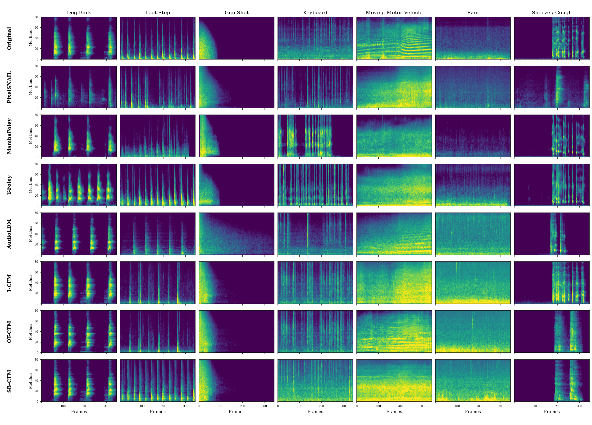

# SB-CFM — Scene-Conditioned Foley Sound Synthesis via Schrödinger Bridge Conditional Flow Matching

Audio demo page for our IEEE Access submission.

**Demo:** https://jjj33325.github.io/sbcfm-demo

Eojin Kim, Nam In Park, Chanjun Chun
Chosun University · National Forensic Service · Glosori Inc.


**Fig. 1** — Overview of the proposed pipeline. *Training* (top): a target log-mel spectrogram x₁ and
a Gaussian source x₀, paired within their scene class by the optimal-transport plan, are joined by
the Schrödinger-bridge path into x_t; the velocity U-Net v_θ(x_t, t, c, r) — modulated by the
timestep, the class embedding, and the RMS envelope — regresses the target velocity. *Inference*
(bottom): the same network defines the velocity field, which classifier-free guidance turns into
the guided field integrated by a uniform Euler solver over 50 steps; HiFi-GAN renders the result.
One network is trained and the sampler is deterministic — no score network and no stochastic term.

---

## What this is

A mel-domain Foley synthesis framework for the DCASE 2023 Challenge Task 7 benchmark, which
asks a system to generate a four-second monophonic clip at 22.05 kHz from one of seven scene
categories: dog bark, footstep, gunshot, keyboard, moving motor vehicle, rain, and sneeze/cough.

The task is small-data (about 5.4 hours of labeled audio) and one-to-many: each label admits many
acoustically valid realizations, so the central tension is between scene fidelity and diversity.
We transport a standard Gaussian source to the data along the **Schrödinger bridge — the
entropy-regularized form of dynamic optimal transport**, whose marginal is the OT displacement
interpolation convolved with a Gaussian kernel that vanishes at both endpoints. This smooths the
interior of the transport path, so the velocity field the network regresses is better conditioned
than the unregularized OT field, while the source and data distributions are matched exactly.
Generation integrates the resulting velocity field as an **ordinary differential equation** — no
score network is trained and no stochastic sampling is used, so the method stays in its original
deterministic form.

Three things distinguish the model:

- **Schrödinger bridge as regularized OT.** SB-CFM recovers OT-CFM exactly in the deterministic
  limit σ→0, and replacing the intra-class OT coupling with independent pairing recovers I-CFM —
  two exact reductions of different kinds, one continuous and one a change of coupling, so the flow
  formulation can be decomposed one axis at a time. The coupling supplies roughly 54% of the
  improvement from independent pairing to the full model (FAD 4.53 → 3.56) and the bridge the
  remaining 46% (3.56 → 2.75), with an interior optimum at σ=0.2 at which FAD, KAD, density, and
  coverage turn together.
- **RMS temporal conditioning.** The frame-level RMS envelope of the target is injected through
  block-wise FiLM, giving explicit control over *when* energy appears. It is the single most
  important component: removing it more than doubles FAD.
- **Velocity-only, deterministic ODE.** A single velocity network is trained and generation
  integrates the probability-flow ODE over 50 uniform Euler steps at guidance w = 3.0. No score
  network, no stochastic sampler.

## Results

Averaged over the seven scenes on DCASE 2023 Task 7. SB-CFM reaches FAD 2.75, a 42.3% reduction
over the strongest baseline. All numbers come from a single training run without seed averaging.

| Model | FAD ↓ | KAD ↓ | Acc ↑ | Density ↑ | Cover. ↑ | CLAP ↑ | E-L1 ↓ |
|---|---|---|---|---|---|---|---|
| PixelSNAIL | 10.07 | 6.82 | 0.80 | 0.753 | 0.444 | 0.206 | – |
| MambaFoley | 7.63 | 1.62 | 0.96 | 1.102 | 0.572 | 0.295 | 0.0374 |
| T-Foley | 8.03 | 2.29 | 0.93 | 1.000 | 0.528 | 0.285 | 0.0344 |
| AudioLDM | 4.77 | 0.86 | 0.98 | 1.001 | 0.564 | **0.358** | – |
| I-CFM (ours, indep. coupling) | 4.53 | 0.58 | 0.95 | 1.165 | 0.697 | 0.327 | 0.0232 |
| OT-CFM (ours, intra-class OT, σ=0) | 3.56 | 0.57 | 0.97 | 1.320 | 0.705 | 0.335 | 0.0232 |
| **SB-CFM (ours)** | **2.75** | **0.54** | **0.99** | **1.528** | **0.721** | 0.338 | **0.0230** |

The lower block is our own flow-matching variants, which share the architecture, conditioning,
training schedule, guidance scale, and a 50-step Euler budget, and differ only in the flow
formulation. Density and coverage (PANNs embeddings, k=5) replace the intra-class-diversity
diagnostic used in earlier work; density is not capped at one.

SB-CFM is best on six of the seven metrics — FAD, KAD, accuracy, density, coverage, and E-L1.
The E-L1 margin belongs to the RMS conditioning rather than to the flow formulation: it is flat
across our three variants (0.0232 / 0.0232 / 0.0230) and the gap that matters is against the
waveform-domain baselines (0.0344, 0.0374). The one metric it does not lead is **CLAP**, where
AudioLDM (0.358) stays ahead — a general-purpose text-to-audio model whose large-scale
language–audio pre-training is expected to favour a text-embedding metric that our class-conditional
model, trained only on this small corpus, does not directly optimize. E-L1 applies only to
temporally conditioned models.

Two caveats bound comparability. The AudioLDM checkpoint we run is the general-purpose model,
not the challenge entry built on it, which added task-specific pre-training on external corpora.
And a single guidance scale w = 3.0 is used throughout — every baseline at its published default,
all of our own variants sharing the same w — so the ablations vary the flow formulation alone.

### Per scene

Column means reproduce the FAD column above. Every system is worst on *moving motor vehicle* and
best on *sneeze/cough*.

| Scene | PixelSNAIL | MambaFoley | T-Foley | AudioLDM | I-CFM | OT-CFM | SB-CFM |
|---|---|---|---|---|---|---|---|
| Dog bark | 10.92 | 6.13 | 8.16 | 5.17 | 6.24 | 2.21 | **2.15** |
| Footstep | 10.29 | 8.64 | 7.71 | 4.89 | **2.23** | 3.08 | **2.23** |
| Gunshot | 8.40 | 4.87 | 5.02 | 5.66 | 2.94 | **1.99** | 2.78 |
| Keyboard | 4.72 | 9.62 | 7.43 | 2.67 | 2.65 | 2.44 | **1.89** |
| Moving motor vehicle | 19.60 | 13.61 | 19.24 | 7.21 | 12.68 | 10.20 | **5.84** |
| Rain | 13.15 | 6.72 | 5.31 | 6.27 | **3.61** | 4.22 | **3.61** |
| Sneeze/cough | 3.41 | 3.79 | 3.36 | 1.50 | 1.36 | 0.79 | **0.73** |
| **Mean** | 10.07 | 7.63 | 8.03 | 4.77 | 4.53 | 3.56 | **2.75** |

The difficulty is concentrated rather than distributed: of the mean improvement from I-CFM to
SB-CFM, 88% comes from two scenes alone — moving motor vehicle (12.68 → 5.84) and dog bark
(6.24 → 2.15). It also cuts across the transient/texture division: rain, the other texture, sits at 3.61, far
closer to the transient range of 0.73–2.78 than to moving motor vehicle at 5.84 — so what separates
that scene is not that it is a texture but that it is a broadband one whose spectral content is
sustained. SB-CFM holds or
shares the lowest FAD in six of the seven scenes; the one it loses is gunshot, the sparsest and
most impulsive class, whose identity rests on a single onset that smoothing the transport interior
is least suited to preserve.



**Fig. 2** — Mel-spectrogram comparison across the seven categories, shown for the first sample of
each. Rows, top to bottom: original recording, PixelSNAIL, MambaFoley, T-Foley, AudioLDM, I-CFM
(independent coupling), OT-CFM (intra-class OT, σ=0), SB-CFM. **SB-CFM matches the Original most
closely of all systems** — it reproduces the sharp onsets of transient categories and the harmonic
and broadband structure of tonal and textured ones, where the discrete baseline blurs fine detail
and the diffusion baselines add high-frequency artifacts.

Every scene, three clips per system, plus the envelope-tracking overlays are on the
[demo page](https://jjj33325.github.io/sbcfm-demo).

## Repository layout

```
index.html                  the demo page
assets/                     figures
  pipeline.png              Fig. 1 — training and generation pipeline
  spectrograms.png          Fig. 2 — mel-spectrogram comparison, all systems x all scenes
  envelope.png              Fig. 3 — generated vs. conditioning RMS envelope, per scene
audio/                      4 s, 22.05 kHz, systems compared as published (see note below)
  original/                 original recording, DCASE 2023 eval split
  pixelsnail/
  tfoley/
  mambafoley/
  audioldm/
  icfm/                     ours, independent coupling (I-CFM ablation)
  otcfm/                    ours, intra-class OT, σ=0 (OT-CFM ablation)
  sbcfm/                    ours, σ=0.2, deterministic ODE
```

Each system folder holds three clips per scene, named `<scene>_1`, `<scene>_2`, `<scene>_3`, where
`<scene>` is one of `dog_bark`, `footstep`, `gunshot`, `keyboard`, `moving_motor_vehicle`, `rain`,
`sneeze_cough`.

Within a column, every temporally conditioned system was given the same RMS envelope, taken from
the original recording in that column.

Systems are compared as published rather than under a shared vocoder. SB-CFM, OT-CFM, I-CFM, and
PixelSNAIL use the official DCASE HiFi-GAN vocoder; T-Foley and MambaFoley synthesize waveforms
directly and use no vocoder; AudioLDM uses the vocoder shipped with its own pipeline.

## Editing the page

The scene list, the system list, and the number of samples per scene live in a single config block
at the top of the `<script>` in `index.html`. Change those and the sample table regenerates itself.

## Citation

```bibtex
@article{kim2026sbcfm,
  title   = {Scene-Conditioned Foley Sound Synthesis via Schr\"{o}dinger Bridge Conditional Flow Matching},
  author  = {Kim, Eojin and Park, Nam In and Chun, Chanjun},
  journal = {IEEE Access},
  year    = {2026}
}
```

## Contact

jjj333@chosun.ac.kr
